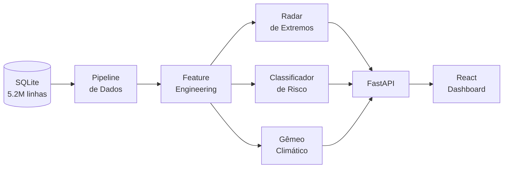
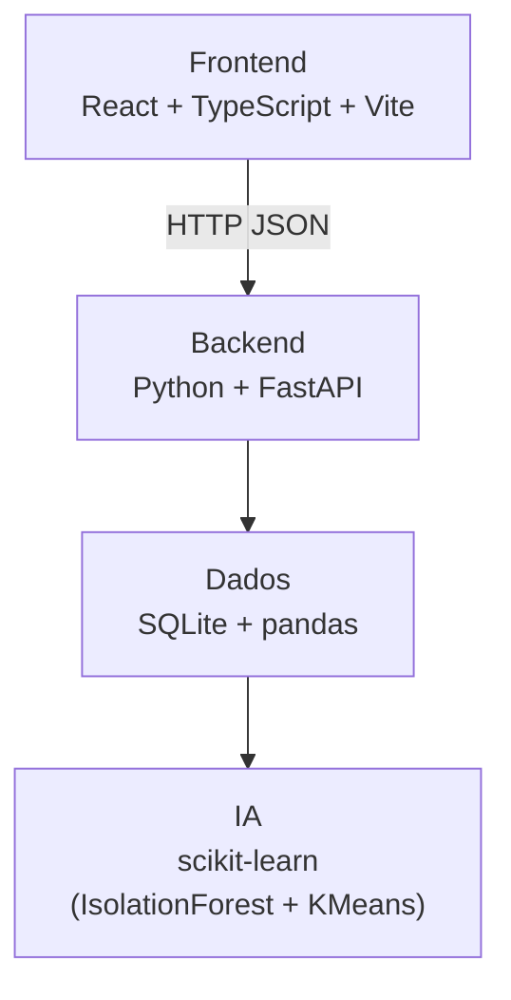

# Spec: Tela Metodologia / Como Funciona

**Este arquivo:** specs/frontend/metodologia-tela.md
**Workflow obrigatório:** Spec → Test → Code → Review → Commit — ver [specs/WORKFLOW.md](../WORKFLOW.md)

## O quê

Tela estática para defesa técnica na banca.
Explica o fluxo de dados, os módulos de IA e o score de risco — sem entrar em código.

## Por quê

Banca avalia pitch e defesa (20pts). Ter uma tela de metodologia na demo mostra profundidade técnica e preparo.

## Critérios de aceite

- [ ] Diagrama de fluxo do pipeline: banco → features → modelos → API → frontend
- [ ] Resumo de cada módulo de IA: Radar, Classificador, Gêmeo (1 parágrafo + métrica chave)
- [ ] Explicação do score de risco: fatores, pesos, faixas
- [ ] Tabela do banco: variáveis usadas, volume, período
- [ ] Seção de impacto: quem usa, como usa, benefício prático
- [ ] Tela funciona completamente offline (conteúdo estático, sem fetch)
- [ ] Diagramas gerados com Mermaid.js renderizado no browser

## Fora de escopo

- Código-fonte inline
- Exportação de PDF (Pitch.pdf é separado)
- Métricas de performance do modelo (não temos ground truth)

## Conteúdo dos diagramas (Mermaid)

### Fluxo de dados



### Stack



## Componentes necessários

```
MetodologiaPage
  ├── MermaidDiagram       — wrapper para renderizar Mermaid no browser
  ├── ModuleCard           — card de cada módulo de IA
  ├── DataSummaryTable     — tabela de variáveis e volume
  ├── RiskScoreExplanation — pesos + faixas
  └── ImpactSection        — quem usa + benefício
```

## Tasks

- [ ] **T1** Instalar `mermaid` package (`npm install mermaid`)
- [ ] **T2** Criar `MermaidDiagram` component — inicializa mermaid + renderiza string de diagrama
- [ ] **T3** Criar `ModuleCard` — ícone, nome, descrição, métrica chave
- [ ] **T4** Criar `DataSummaryTable` — estática, dados do dicionário
- [ ] **T5** Criar `RiskScoreExplanation` — tabela de fatores e pesos
- [ ] **T6** Implementar [`frontend/src/pages/MetodologiaPage.tsx`](../../frontend/src/pages/MetodologiaPage.tsx) com todas as seções
- [ ] **T7** Adicionar rota `/methodology` no React Router
- [ ] **T8** Adicionar link para Metodologia no menu/nav principal
- [ ] **T9** Verificar renderização offline (sem CDN)
- [ ] **T10** Rodar todos os testes — verde
- [ ] **T11** Code review
- [ ] **T12** Commit: `feat(frontend): implement methodology screen`

## Dependências

- Setup base React Router (qualquer outra tela pode estar pendente — esta é estática)

## Workflow

```
Spec → Test → Code → Review → Commit
```
1. Ler este spec completo
2. Escrever testes (ver path de testes acima) — rodar: devem falhar
3. Implementar até testes passarem
4. `/caveman-review` — code review
5. `git commit` com mensagem do formato especificado
6. Marcar tasks como ✅ em [specs/MASTER.md](../MASTER.md)
